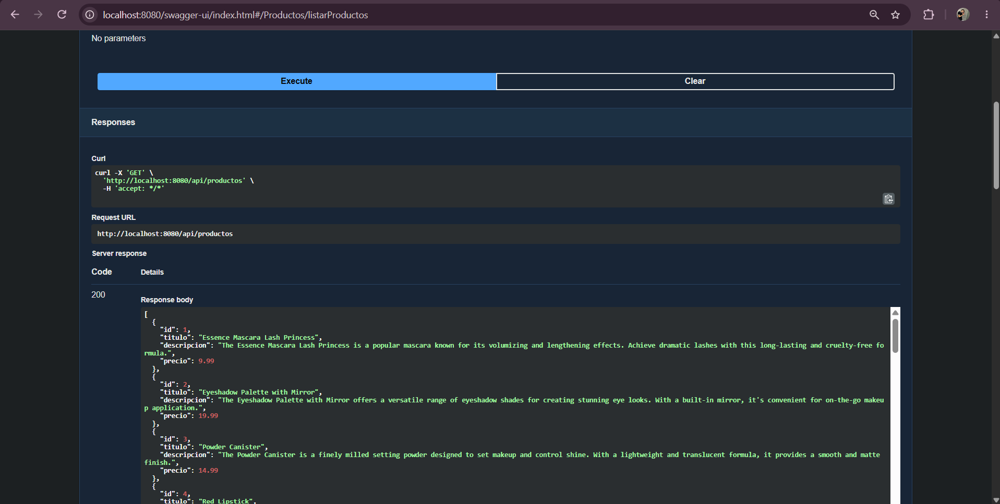
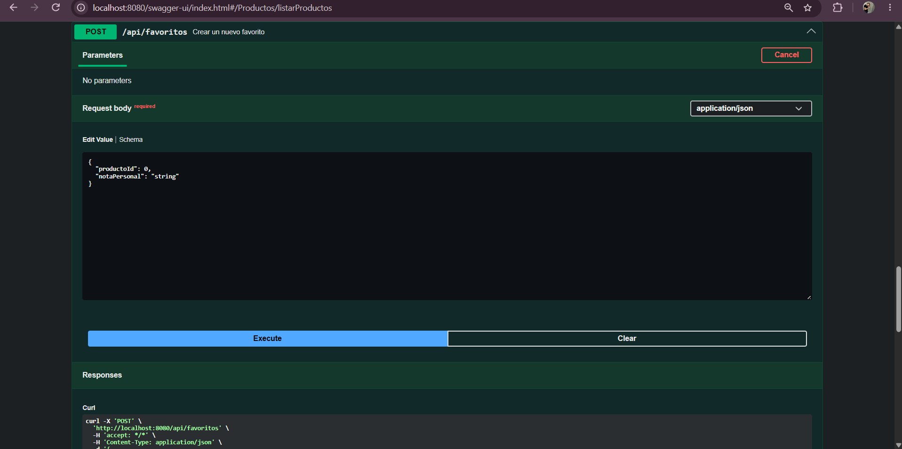
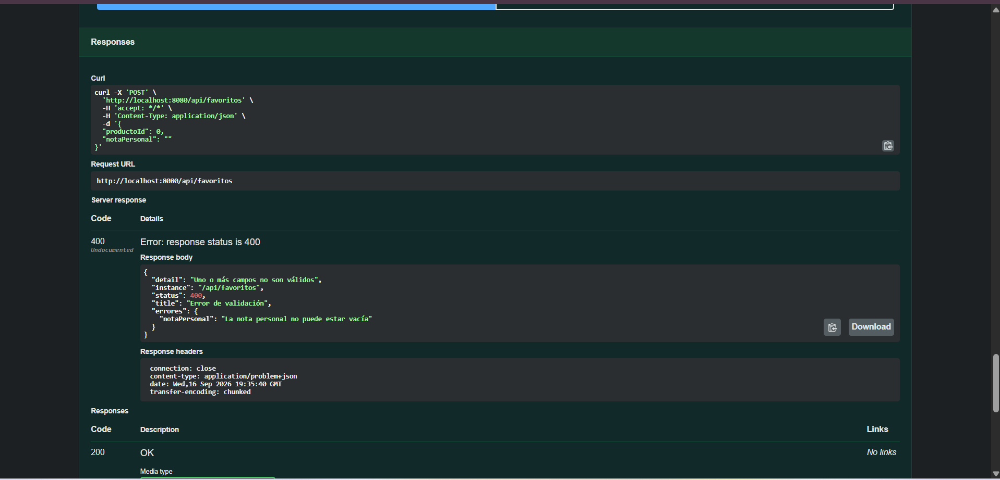
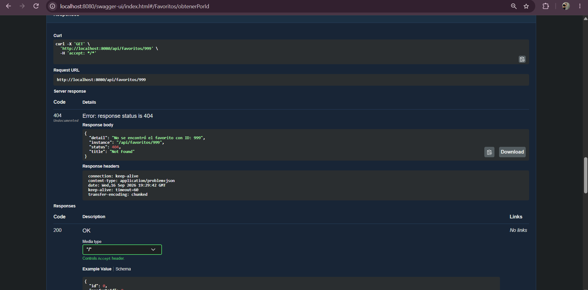

# TP1 · Spring Boot, API REST y arquitectura en capas

Este repositorio contiene la resolución del Trabajo Práctico 1. Se implementó una arquitectura en capas consumiendo una API externa (DummyJSON) y desarrollando un CRUD completo en memoria para gestionar "Favoritos".

## 🚀 Cómo levantar el proyecto

El proyecto requiere **Java 25**. Para ejecutarlo, utilizar siempre el wrapper de Maven incluido en el repositorio.

**Windows:**
```bash
.\mvnw.cmd spring-boot:run
```

**macOS/Linux:**
```bash
./mvnw spring-boot:run
```

Una vez que la consola muestre `Started DemoApplication`, la aplicación quedará escuchando en `http://localhost:8080`.

## 📚 Documentación y Pruebas (Swagger UI)

La API está completamente documentada utilizando Springdoc OpenAPI. Para interactuar con los endpoints y realizar pruebas directas, ingresar a la siguiente URL desde el navegador:

👉 **http://localhost:8080/swagger-ui/index.html**

## 🛠️ Recursos implementados
* **Productos (`/api/productos`)**: Consumo de API externa DummyJSON (solo lectura).
* **Favoritos (`/api/favoritos`)**: CRUD completo en memoria con validación de datos (`POST`, `GET`, `PUT`, `DELETE`).

## 📸 Evidencia de Funcionamiento

A continuación se detallan las pruebas realizadas en Swagger UI solicitadas en la consigna:

### 1. Caso de éxito: Listar Productos (GET)


### 2. Caso de éxito: Crear Favorito (POST)


### 3. Caso de error: Validación (400 Bad Request)


### 4. Caso de error: Recurso No Encontrado (404 Not Found)

