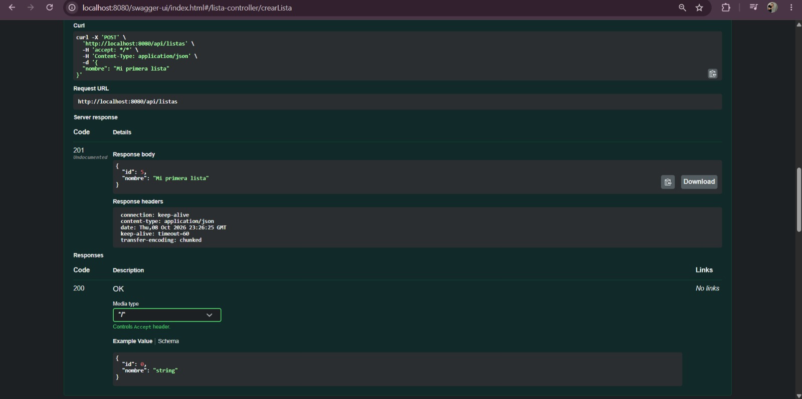
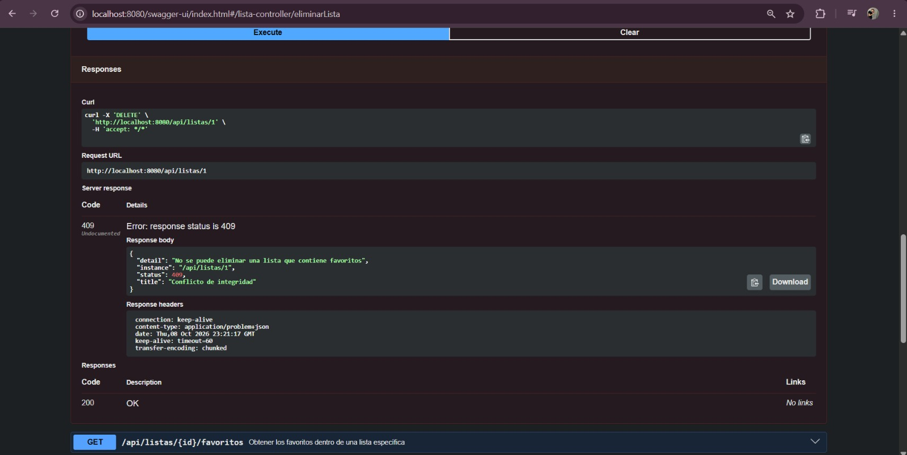
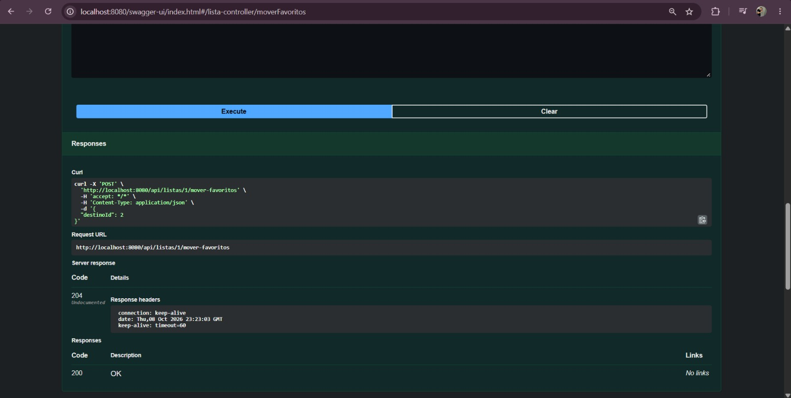

# TP2 · Persistencia, migraciones y arquitectura hexagonal

Repositorio correspondiente al Trabajo Práctico Nº 2 de la materia Desarrollo de Aplicaciones Web II (Universidad Nacional de Villa Mercedes).

## 🚀 Cómo levantar la base de datos y la aplicación

1. **Base de datos (PostgreSQL):**
   Asegurate de tener Docker instalado y ejecutá el siguiente comando en la raíz del proyecto para levantar la instancia de PostgreSQL:
```bash
   docker-compose up -d
```

2. **Migraciones (Flyway):**
   Las migraciones de la base de datos se ejecutan de manera automática al iniciar la aplicación mediante Flyway.

3. **Ejecutar la aplicación:**
   Podés correr el proyecto desde tu IDE favorito o a través de Maven:
```bash
   mvn spring-boot:run
```

## 📝 Justificaciones Teóricas y Decisiones de Diseño (Consignas del TP)

### 1. Puertos y Adaptadores (Por qué el Service/Controller no se tocaron)

Durante la migración de memoria a base de datos, solo se modificaron las clases de infraestructura (como los repositorios JPA y las Entities) y se creó un nuevo `FavoritoRepositoryAdapter`. Las clases de dominio, el `FavoritoService` y el `FavoritoController` no sufrieron cambios en sus lógicas principales (salvo la adición del campo `listaId` requerido). Esto fue posible gracias a la Arquitectura Hexagonal: nuestro Service depende de un Puerto (la interfaz `FavoritoRepository`) y no de una tecnología específica. Al cambiar la implementación en memoria por PostgreSQL, simplemente conectamos un nuevo Adapter detrás de esa misma interfaz, manteniendo el núcleo completamente desacoplado de la infraestructura.

### 2. Evolución del Esquema (Por qué no se edita V1 o V2)

Para evolucionar el esquema de la base de datos (por ejemplo, hacer que `lista_id` sea obligatorio en los Favoritos antiguos), se creó una nueva migración `V4__lista_id_obligatorio.sql` en lugar de editar las migraciones V1, V2 o V3 ya aplicadas. Esto se debe a que Flyway lleva un registro estricto de las versiones en la tabla `flyway_schema_history`. Si se modificara un archivo ya aplicado, Flyway detectaría un conflicto en el checksum (la firma del archivo) y bloquearía el arranque de la aplicación por seguridad, garantizando de este modo la inmutabilidad y la consistencia del esquema en todos los entornos.

### 3. Transacciones y Propiedades ACID

En el endpoint encargado de mover los favoritos de una lista a otra y eliminar la lista de origen (`POST /api/listas/{origenId}/mover-favoritos`), se utilizó la anotación `@Transactional`. Si se quitara esta anotación y ocurriera un fallo a mitad de camino (por ejemplo, los favoritos se reasignan con éxito a la nueva lista, pero ocurre un error al intentar borrar la lista original), la base de datos quedaría en un estado inconsistente. El uso de transacciones garantiza la Atomicidad (la 'A' de ACID): o se ejecutan todas las operaciones de escritura correctamente, o se revierte todo el bloque (rollback) de forma segura.

## 📸 Evidencias de Pruebas (Swagger)

- Éxito al crear favorito (201 Created):

  

- Error 409 al borrar lista con favoritos:

  

- Éxito al mover favoritos y borrar lista (204 No Content):

  